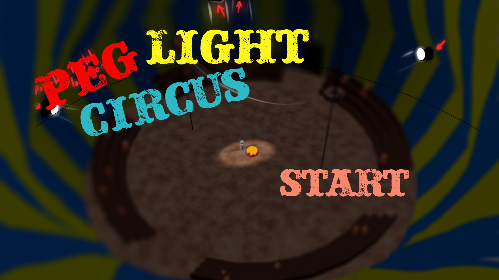
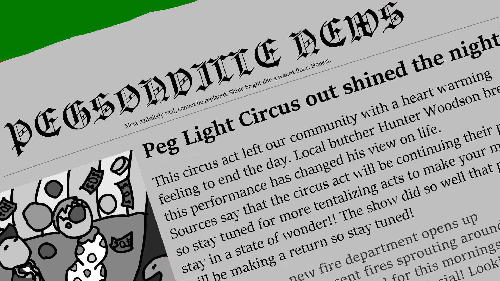

# Peg Leg Circus

Created during the [2024 Global Game Jam](https://globalgamejam.org/games/2024/peg-light-circus-0) by Team Peg Light Circus in 48 hours.

## Description

You are not the star of the show, but the lights that focus on the stars. You will play as a pair of spot lights in the circus that make sure the focus is on the good stuff. Bad lighting, or focusing on the wrong stuff could spell disaster and get you some bad reviews. Then you'll never work in this circus ever again! That's what you get for running away from home.

## Instructions
Control the left light with WASD
Control the right light with OKL; (semi-colon)

## Screenshots

## Members
- [GBAer64](https://globalgamejam.org/users/gbaer64)
- [BUNN1E5](https://globalgamejam.org/users/bunn1e5)
- [Nas](https://globalgamejam.org/users/nas-0)
- [Gonryun](https://globalgamejam.org/users/gonryun)
- [Alexis Patterson](https://globalgamejam.org/users/alexis-patterson)
